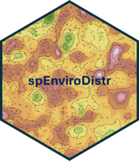

<div align="center">



# spEnviroDistr
### Spatial Analysis and Environmental Data Distribution in R

<!-- badges: start -->
[](https://codecov.io/github/djwillichile/spEnviroDistr)

[](https://opensource.org/licenses/MIT)
<!-- badges: end -->

</div>

<div align="justify">

`spEnviroDistr` is an R package designed to provide advanced tools for the spatial analysis and distribution of environmental and geographic variables. The package is focused on enabling geospatial analysis in fields such as ecology, geography, geology, and environmental sciences. It includes specialized functions for conducting Geographically Weighted Regression (GWR), managing parallel processing clusters, filling missing values in raster data, and converting data frames into spatial grid objects. Additionally, it provides well-known datasets like 'meuse' and 'meuse.grid' for demonstrating spatial data analysis techniques.

</div>

## ️📦 Installation

You can install the development version of `spEnviroDistr` from [GitHub](https://github.com/djwillichile/spEnviroDistr) with:

```r
# install.packages("devtools")
devtools::install_github("djwillichile/spEnviroDistr")
```

## Example

This is a basic example which shows you how to solve a common problem:

``` r
library(spEnviroDistr)

# Load the meuse dataset
data(meuse, package = "spEnviroDistr")
coordinates(meuse) <- ~x + y
proj4string(meuse) <- CRS("+init=epsg:28992")

# View a summary of the data
summary(meuse)

# Apply Geographically Weighted Regression (GWR)
cl <- createCluster(free = 2) # Create a parallel processing cluster with 2 free cores
# Apply GWR to model the relationship between copper concentration and altitude, distance, and elevation
result <- applyGWR(log(copper) ~ alt + dist + elev, data = meuse, longlat = FALSE, cl = cl)
stopCluster(cl) # Stop the parallel processing cluster to free resources

# View GWR results
print(result$output)

# Plot results on a prediction grid
data(meuse.grid, package = "spEnviroDistr")
coordinates(meuse.grid) <- ~x + y
proj4string(meuse.grid) <- CRS("+init=epsg:28992")
gridded(meuse.grid) <- TRUE

spplot(meuse.grid, "alt") # Plot the altitude variable on the grid

# Apply GWR on prediction grid and model fitting points
cl <- createCluster(free = 2) # Create a new parallel processing cluster
result <- applyGWR(log(copper) ~ alt + dist + elev, data = meuse,longlat = FALSE,
cl = cl, fit.points = meuse.grid)
stopCluster(cl)

# Plot predicted values from GWR results
spplot(result$output$SDF, "pred")

```

## 💡 Key Functions

- **`applyGWR`**: Applies Geographically Weighted Regression (GWR) to a spatial dataset.
- **`createCluster`**: Creates a cluster for parallel processing.
- **`downscale`**: Performs spatial downscaling of low-resolution raster data using predictors.
- **`fillNA`**: Fills NA values in a `SpatRaster` object using a focal median filter.
- **`toGrid`**: Converts a data frame into a Spatial Grid object.
- **`toPredictors`**: Resamples and converts a list of raster layers into a predictors object.
- **`toSpatData`**: Converts a `SpatRaster` object to a spatial points data frame for spatial analysis.

## 🙏 Acknowledgements

I would like to extend my heartfelt gratitude to **Luis Morales-Salinas**, whose mentorship has been pivotal not only in the creation of this package, but also throughout my educational and professional development. His expertise and guidance were instrumental in shaping the methods and approaches used in `spEnviroDistr`. The package, and much of my growth as a professional, would not have been possible without his unwavering support and invaluable insights.

I would also like to thank **Julián Cabezas-Peña**, who guided me through my first steps in R and helped me discover the beauty of this language. His early encouragement sparked my passion for R programming and spatial data analysis.

## 🗃 Maintainers and License

🧑️ **spEnviroDistr** is primarily maintained by [Guillermo Fuentes-Jaque](https://github.com/djwillichile).

📃 **spEnviroDistr** is licensed under the [MIT License](https://opensource.org/licenses/MIT).

## Contributions and Community


## 💻 Contribution

If you want to contribute to `spEnviroDistr`, please follow these steps:

1. Fork the repository.
2. Create a new branch (`git checkout -b feature-branch`).
3. Make your changes (`git commit -am 'Add new feature'`).
4. Push to the branch (`git push origin feature-branch`).
5. Create a Pull Request on GitHub.


## 📚 References

- R Documentation: [gstat](https://cran.r-project.org/web/packages/gstat/gstat.pdf) for more details on the `meuse` and `meuse.grid` datasets.
- WorldClim and ASTER for elevation and temperature datasets: [WorldClim](https://www.worldclim.org/data/index.html)
- **`spgwr` package**: [spgwr](https://cran.r-project.org/web/packages/spgwr/spgwr.pdf) for implementing Geographically Weighted Regression in R.
- Recommended Books:
  - **"Principles of Geographical Information Systems"** by P.A. Burrough and R.A. McDonnell.
  - **"Spatial Data Analysis with R"** by Roger Bivand, Edzer Pebesma, and Virgilio Gómez-Rubio.
  - **"Geographically Weighted Regression: The Analysis of Spatially Varying Relationships"** by A. Stewart Fotheringham, Chris Brunsdon, and Martin Charlton.

